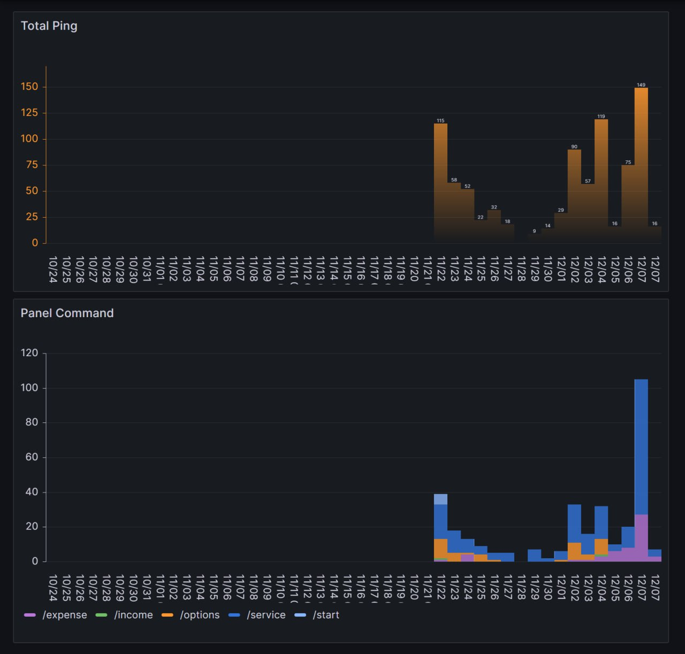

# Telegram Bot Copilot v2

*Многофункциональный Telegram бот для повседневных задач с поддержкой нескольких языков.*

## Основные функции

- 🌊 Прогноз погоды
- 💵 Курсы валют
- 😺 Отправка случайных фото котиков
- 🤖 Интеграция с LLM
- 📖 Кулинарная книга
- 🍕 Калькулятор пиццы
- 💝 Система донатов

## Технологии

- Python 3.11
- aiogram 3.8.0
- PostgreSQL
- Redis
- InfluxDB + Grafana
- Docker
- JavaScript + HTML5 + CSS3

## Установка и запуск

1. Клонируйте репозиторий
2. Создайте файл .env на основе .env.example и заполните необходимые переменные окружения
3. Запустите проект через Docker Compose

## Структура проекта
```
bot_04_copilot_v2/
├── app.py                 # Точка входа
├── handlers/              # Обработчики команд
├── middlewares/           # Промежуточные обработчики
├── database/              # Работа с БД
├── common/                # Общие компоненты
├── locales/               # Файлы локализации
└── docs/                  # Веб-приложения
```

## Аналитика

*Собираем и визуализируем аналитику с помощью InfluxDB и Grafana*


